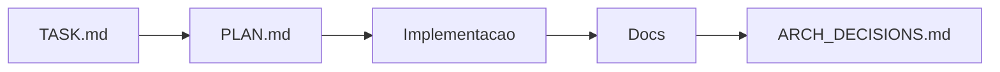

# CadenceCode AI Kit

Bootstrap para projetos guiados por IA com documentacao inicial, guardrails operacionais, contexto de seguranca e templates para times que querem comecar rapido sem perder clareza.

## Instalação

Forma recomendada:

```bash
npm init cadencecode-ai-kit
```

Alternativa com instalacao local:

```bash
npm install -D create-cadencecode-ai-kit
npx cadencecode-ai-kit init
```

## Uso Rápido

No diretorio atual:

```bash
npm init cadencecode-ai-kit
```

Em outro diretorio:

```bash
npm install -D create-cadencecode-ai-kit
npx cadencecode-ai-kit init --dir ./meu-projeto
```

Com preset:

```bash
npm install -D create-cadencecode-ai-kit
npx cadencecode-ai-kit init --preset next
npx cadencecode-ai-kit init --preset node
npx cadencecode-ai-kit init --preset saas
```

Opcoes uteis:

```bash
cadencecode-ai-kit init --force
cadencecode-ai-kit init --dry-run
cadencecode-ai-kit init --skip-readme
cadencecode-ai-kit init --next
cadencecode-ai-kit init --node
cadencecode-ai-kit init --saas
cadencecode-ai-kit --help
```

## O Que Este Repositório É

Este repositorio publica o `CadenceCode AI Kit`, um pacote npm no formato `create-*` pensado para:

- bootstrap de projetos com IA
- documentacao inicial para produto, arquitetura, backlog e seguranca
- alinhamento entre humanos e agentes com `TASK.md`, `PLAN.md`, `AGENTS.md` e `SYSTEM_PROMPT.md`
- contexto security-first para times que usam IA para programar
- organizacao minima antes de gerar codigo

Se alguem procurar por termos como `ai starter kit`, `agent engineering template`, `project bootstrap with AI`, `security-first ai coding` ou `npm init template for AI projects`, este e exatamente o tipo de repositorio que deve encontrar.

## Metas Do Kit

As metas principais deste kit sao:

- reduzir ambiguidade no inicio do projeto
- acelerar onboarding de pessoas e agentes
- criar uma base minima de documentacao viva
- diminuir erros comuns de seguranca em projetos feitos com ajuda de IA
- forcar contexto antes de implementacao
- manter simplicidade em vez de overengineering

## O Que Ele Entrega

Ao rodar o CLI, o kit:

- copia arquivos base para o projeto
- cria `docs/` com produto, arquitetura, backlog e seguranca
- adiciona `TASK.md`, `PLAN.md`, `AGENTS.md`, `SYSTEM_PROMPT.md` e `ARCH_DECISIONS.md`
- renomeia `README.template.md` para `README.md` quando o projeto ainda nao tem README
- cria ou complementa `.gitignore`
- permite presets como `next`, `node` e `saas`
- preserva arquivos existentes por padrao
- permite sobrescrever com `--force`

O foco atual e preparar contexto e guardrails, nao gerar a aplicacao em si.

Fluxo sugerido de uso:



## Security-First Para Projetos Com IA

Este kit foi fortalecido para um cenario comum hoje: pessoas que nao sao programadoras usando IA para construir software.

Por isso, a base tambem cobre:

- modelagem basica de risco logo no bootstrap
- perguntas de seguranca no `TASK.md` e no `PLAN.md`
- orientacao sobre secrets, `.env`, producao e segregacao de ambientes
- revisao de permissao por papel, recurso, tenant e banco
- alertas contra SQL injection, abuso por scripts, automacoes e excesso de requests
- limites operacionais como rate limit, timeout, payload e upload
- incentivo a testes negativos, auditoria e validacao de cenarios de abuso

O objetivo nao e criar uma arquitetura enterprise por padrao. O objetivo e reduzir erros perigosos cedo, especialmente quando a IA esta ajudando a escrever o codigo.

## O Que Este Kit Nao Faz

Hoje o kit nao:

- cria codigo de aplicacao como `src/`, rotas, componentes ou services
- detecta stack automaticamente
- faz perguntas interativas durante o bootstrap
- publica configuracoes de CI, lint, testes ou deploy
- substitui decisoes do time sobre arquitetura, produto ou seguranca

## Presets

Os presets funcionam como overlays aplicados depois da base:

- `next`: ajusta arquitetura e seguranca para app full-stack em Next.js App Router
- `node`: ajusta arquitetura e seguranca para backend ou servico Node.js e adiciona `.nvmrc`
- `saas`: ajusta `docs/product.md` e `docs/backlog.md` para um SaaS MVP

## Escolha Do Kit

Antes de inicializar um repositorio, escolha o kit mais adequado ao seu fluxo:

- `npx @vudovn/ag-kit init` funciona para qualquer pessoa, inclusive fora do Antigravity
- se escolher `ag-kit`, basta referenciar esse padrao ou pedir ajustes para o seu modo de trabalho
- se quiser um kit mais generico de documentacao, guardrails e seguranca para projetos guiados por IA, use `npm init cadencecode-ai-kit`

O repositorio nao precisa presumir IDE ou editor. A escolha do kit fica aberta para quem esta criando o projeto.

## Estrutura Publicada

```txt
bin/
  cli.js
test/
  cli.test.js
templates/
  .gitignore
  GLOBAL_AGENTS.md
  AGENTS.md
  TASK.md
  PLAN.md
  SYSTEM_PROMPT.md
  ARCH_DECISIONS.md
  README.template.md
  docs/
    architecture.md
    backlog.md
    product.md
    security.md
  presets/
    next/
    node/
    saas/
package.json
README.md
```

## Publicação

Antes de publicar:

1. confirme se o nome `create-cadencecode-ai-kit` esta disponivel no npm ou troque para outro nome `create-*`
2. revise `README.md`, `description` e `keywords`, porque isso e a vitrine do pacote no npm e no GitHub
3. rode `npm test`
4. publique o pacote

Exemplo:

```bash
npm login
npm publish --access public
```

Se voce publicar com outro nome, o comando de uso muda junto. Exemplo: `create-foo-kit` vira `npm init foo-kit`.

## Desenvolvimento Local

```bash
npm install
npm test
npm link
cadencecode-ai-kit init --preset next --dry-run
node ./bin/cli.js init --preset next --dry-run
```

## Próximas Evoluções

- interpolar nome do projeto dentro dos templates
- adicionar perguntas opcionais de bootstrap
- validar ambiente antes da copia
- criar presets adicionais, como `react`, `fastify` e `worker`
